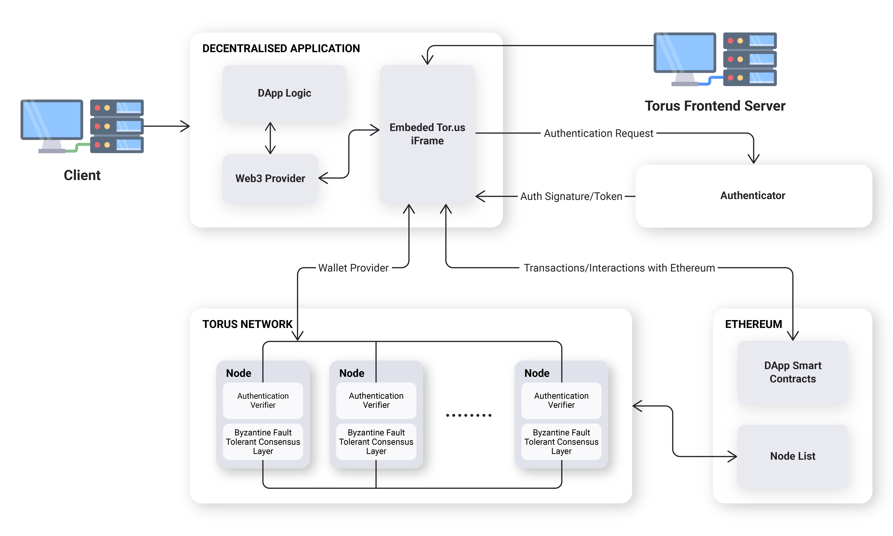

  Torus is a user-friendly, secure, and non-custodial key management system for
  DApps. We're focused on providing mainstream users a gateway to the
  decentralized ecosystem.

---

## Quickstart

[Integrate Torus](getting-started.md) into your DApp with just a few lines of code and give your users an amazing onboarding experience:



Don't just take our word for it, [check it out](https://app.tor.us) for yourself!

## What's Torus, how does it work?

Torus is a user-friendly, fully open source and non-custodial key management system for DApps. It runs a Distributed Key Generation protocol that allows applications to access its generated keys via OAuths and thus existing user accounts. Try out the experience on the [Torus Wallet](https://app.tor.us)

### General Architecture 

The architecture consists of four parts:‌

* Nodes in charge of Distributed Key Generation \(DKG\)
* A smart contract in charge of the management of nodes
* A private BFT network between nodes
* A front-end client/SDK that interacts with nodes

A smart contract is used for node discovery. Nodes are selected, operate for a fixed period, and generate a set of keys via DKG.‌

When a user arrives at a DApp, the client is loaded. From there, a user logs in, they provide proof that they are logged in, and the proof is verified by each node individually. This proof is integrated with the modern OAuth 2.0 Token Authentication flow. For new users, nodes will assign a new key share from the pre-generated set of key shares, and store this assignment in an internal mapping. For returning users, nodes will look up their internal mapping and return that user's corresponding key share.‌

The client then assembles these shares and reconstructs the users key in the front-end. This key is kept for the session and is not persisted in localstorage, or for native apps kept in memory for a session.

For more,  take a look at [System Architecture](how-torus-works/system-architecture.md) or our [high-level write ups](https://medium.com/toruslabs/what-distributed-key-generation-is-866adc79620)

