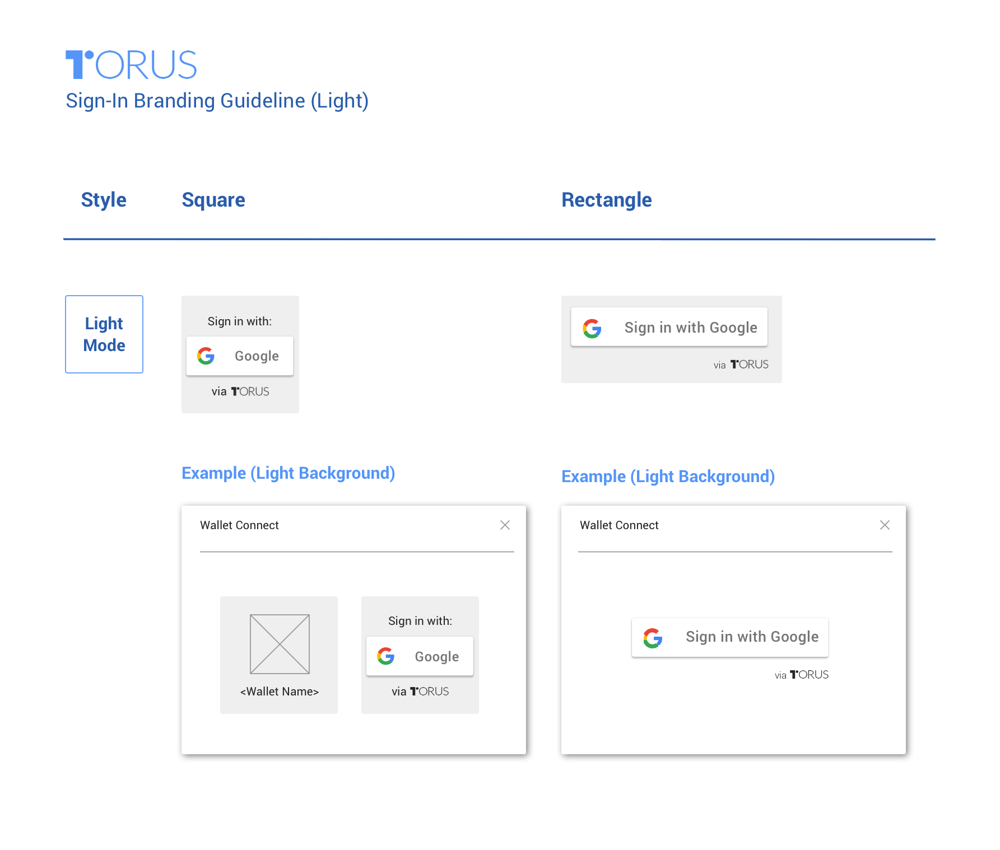
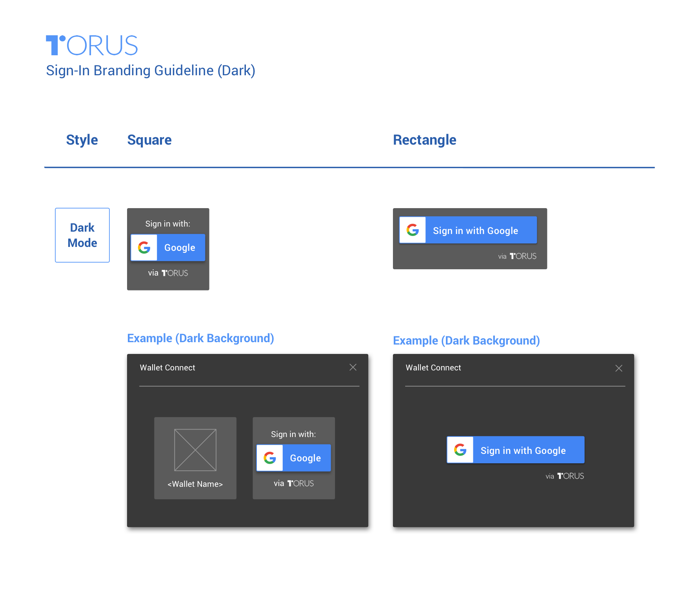

---

title: Sign-In Brand Guideline
sidebar_label: Sign-In Brand Guideline

---

Torus values User Experience. We believe that the following guideline enhances
the seamless on-boarding for users.

---

To facilitate your implementation, we have provided **Sketch file, SVG files below.** These files require the [Roboto font](https://developers.google.com/identity/branding-guidelines#font).



**Torus Sign-In and other third party sign-in options**

**Equal prominence**

The Torus Sign-In button shall be displayed at least as prominently as other third party sign-in options. For example, buttons should be approximately the same size and have similar visual weight.

## Matching your own app's style 

Using the standard OAuth Sign-In button is strongly recommended as it enables users to more quickly identify the options available. If you need to to adapt the text to match your app design, do ensure the "via TORUS" text and logo are clearly visible.

**Size**

You can scale the button as needed for different devices and screen sizes, do preserve the aspect ratio so that the OAuth and Torus logos are not stretched.

**Featured OAuth**

All featured OAuth shall follow their respective brand guidelines available:

* [Google Sign-In Branding Guidelines](https://developers.google.com/identity/branding-guidelines#font)

